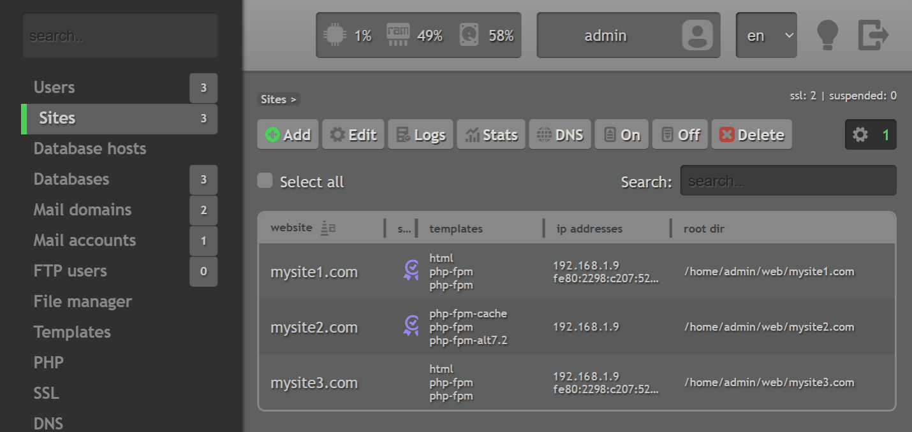

# QWEEC  
### **Web panel for managing websites, databases, mail**

-------------------------------

## Features
- Sites management (via nginx, httpd or both)
- Php-fpm configuration (support for versions 7.2-8.4) 
- SSL certificates
- Website stats in goaccess
- Mysql/Mariadb database management (including in podman containers)
- Mail management (SMTP/IMAP/POP3) via exim and dovecot
- Support for DNS management over Cloudflare and DNSmanager API
- Cron jobs
- Backups
- IP addresses
- Firewall rules management (nftables or iptables)
- Fail2ban
- Server and services state monitoring
- CLI 

-------------------------------

## System requirements
> - Bare metal or KVM virtualization
> - 1 Gb of RAM or more
> - Fresh operating system without pre-installed software:
> - - Rocky linux 9.5+ (amd64)
> - - Almalinux 9.5+ (amd64)
> - Web browser:
> - - Cookies and javascript enabled
> - - Viewport width 900 pixels or bigger

-------------------------------

## Installation

<details open>
<summary>Command for installation with default settings:</summary>

```sh
bash <(curl -sL http://qweec.net/qweec.sh)
```

</details>

<details>
<summary>Installation with custom parameters. (Click for details)</summary>

**Step 1:** Download script
```sh
curl -sSLO http://qweec.net/qweec.sh
```

**Step 2:** Run script with custom parameters
```sh
bash qweec.sh \
    --email=me@example.com \
    --password='MyPasswordHere' \
    --hostname=my.hostname.local \
    --port=1505 \
    --apps='mysql,exim,spamassassin,iptables,podman,quota'
```

### **Supported parameters**
| Argument                        | Description       |
| ------------------------------- | ----------------- |
| `--email`                         | Administrator email |
| `--password`                      | Password, minimal length - 12 characters |
| `--hostname`                      | Server hostname |
| `--port`                          | Web port of panel |
| `--apps`                          | List of packages to be installed on server |

Argument `--apps` supports the next values, separated by comma: 
| Value             | Description                                  | Default            |
| ----------------- | -------------------------------------------- | :-------------------: |
| `mariadb`         | Mariadb DBMS                                 | :heavy_check_mark: |
| `mysql`           | Mysql DBMS (ignored, if `mariadb` specified) | |
| `exim`            | Exim mail server                             | :heavy_check_mark: |
| `clamav`          | Clamav malware scanner for mail              | | 
| `spamassassin`    | Antispam filter for mail                     | | 
| `nftables`        | Nftables firewall                            | :heavy_check_mark: |
| `iptables`        | Iptables firewall (ignored, if `nftables` specified) | |
| `podman`          | Container management system for databases    | |
| `quota`           | User disk quota                              | |

</details>

-------------------------------

## Preview
[](screenshot.gif)

## Languages

- English
- Deutch
- French
- Japanese
- Italian
- Spanish
- Russian
- Ukrainian

<details>
<summary>Adding custom language manually. Click for details</summary>

You can add your language, if needed, for this follow the next instructions:  
Edit the file `/usr/local/qweec/web/lang.txt`  
1. In the first line add BCP 47 language tag  
2. Add translation for each present line, you see in the file in format:  
`langtag: Translated text`  
Each section should be divided by empty line  
3. Save file and restart the panel:  
```sh
systemctl restart qweec
```
4. Login into the panel and select your language from the list in the top right corner  

</details>

## Yapping

The main goal of the panel is to be simplistic.  
it does not overwhelm the user with advanced settings, takes minimalistic approach to make managing basic everyday tasks simple and quick, thus where the word "qweec" comes from, it is not about performance of the panel, it is about simplicity and convenience.

The panel is free to use for everyone.  
It is created in an oldschool fashion with basic web design and "UX first" philosophy in mind, written in Go and Javascript.

Panel is suited primarily for PHP websites, but nginx and httpd templates can be manually created and used within panel for serving any other web systems (Python, NodeJS, etc)

The panel was inspired by old Vesta control panel, when old version started to fade out.
It does not mean that this is a rewrite of Vesta, it is a different panel with it's own implementation, made from scratch, at the same time, some features, configs and template formats are intentionally made similar, so people, who are used to working in Vesta, could feel at home using this panel too.  

It is still in the early developement and not recommended for production use, but is already working and can be used in a developement or other non-critical environments.

## Bug reports

Main repository located at the [Gitlab](https://gitlab.com/qweec/qweec)  
Please post any bug reports there: [Issues page](https://gitlab.com/qweec/qweec/-/issues)
